<p align="center">
  
</p>

# tad

A tmux session and group manager. Bare `tad` opens a native TUI dashboard
that cycles between live sessions, named groups, and the hosts inside those
groups, with live updates every ~1.5s. `tad <name>` attaches or creates a
session. `tad -g <group>` opens a multi-host session whose layout you
control per group.

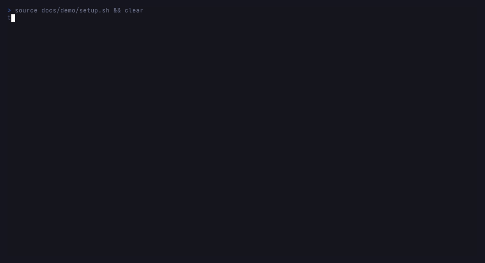

## Install

Only requirement at runtime: `tmux`. No fzf needed — the dashboard is
built into the binary via ratatui.

### From a release (no compile needed)

Grab the latest from
https://github.com/ttpears/tad/releases. Each release has a Linux
x86_64 binary and matching completion files attached.

```sh
mkdir -p ~/.local/bin \
         ~/.local/share/bash-completion/completions \
         ~/.local/share/zsh/site-functions

VERSION=v0.3.0
BASE="https://github.com/ttpears/tad/releases/download/${VERSION}"

curl -L "${BASE}/tad-${VERSION}-x86_64-linux" -o ~/.local/bin/tad
chmod +x ~/.local/bin/tad

curl -L "${BASE}/tad.bash" -o ~/.local/share/bash-completion/completions/tad
curl -L "${BASE}/_tad"     -o ~/.local/share/zsh/site-functions/_tad
```

Make sure `~/.local/bin` is in `PATH` and (for zsh) that
`~/.local/share/zsh/site-functions` is in `fpath`.

### From source

```sh
git clone git@github.com:ttpears/tad.git ~/git/tad
cd ~/git/tad
make install              # builds release binary + installs binary and
                          # completions under ~/.local
```

Or manually:
```sh
cargo build --release
install -Dm755 target/release/tad ~/.local/bin/tad
```

### Shell completions (installed from source)

`make install` puts them in the standard XDG paths. If you installed
the binary by other means, do this once:

bash:
```sh
ln -s ~/git/tad/completions/tad.bash ~/.local/share/bash-completion/completions/tad
```

zsh — add to your `.zshrc` if it's not already:
```sh
fpath=(~/.local/share/zsh/site-functions $fpath)
autoload -Uz compinit && compinit
```

## Migrating from a shell-function `tad`

`tad` started as a small bash function — usually a few lines wrapping
`tmux attach/new-session` with a confirmation prompt. If you've been
carrying something like this around in your `.bashrc`, `.zshrc`, or a
dotfiles repo:

```bash
function tad() {
   local s=$1
   if [ -z "$s" ]; then tmux ls; return; fi
   tmux has-session -t "$s" 2>/dev/null && tmux attach -d -t "$s" \
      || tmux new-session -s "$s"
}
```

…the binary replaces it entirely. To migrate:

1. **Install the binary** (see above). Make sure `~/.local/bin` comes
   before any directory holding the old function on `PATH`. Verify:
   ```sh
   command -v tad     # should print ~/.local/bin/tad
   tad --version      # should print a version number
   ```
2. **Remove the function definition** from your shell rc files. Grep
   for it:
   ```sh
   grep -nE 'function tad|^\s*tad\s*\(\)' ~/.bash* ~/.zsh* 2>/dev/null
   ```
   Then delete those blocks. Functions in your current shell session
   live in memory — `unfunction tad` (zsh) or `unset -f tad` (bash) to
   evict the old one without restarting.
3. **Remove any `complete -F` line** that paired with the old function:
   ```sh
   grep -n 'complete .* tad' ~/.bash*
   ```
   The Rust binary ships its own bash + zsh completions; the old one
   would conflict.
4. **Optional: define your groups**. Open `tad groups-edit` and add
   entries (or run `tad groups-add` for the interactive wizard). The
   config file lives at `~/.config/tad/groups.yaml`. The old function
   knew nothing about groups; everything else is a strict superset of
   the old behavior so existing muscle memory still works:
   - `tad <name>` — attach or create (same as old)
   - `tad` — opens the dashboard (was: list sessions)
   - new: `tad -g <group>`, `tad groups`, `tad complete`, etc.
5. **Optional: pick a theme**. Drop `theme: tokyonight` into
   `~/.config/tad/config.yaml` (or any of the built-ins; see Theme
   section).

Your existing tmux sessions are untouched — `tad` only reads tmux state
and asks tmux to attach/create. Nothing on disk changes for tmux.

## Usage

```
tad                          fzf dashboard (sessions / groups / hosts)
tad <session>                attach or create a tmux session by name
tad -g <group>               open the group per its layout
tad -g <group> <host>        drill into one host from the group

tad groups                   list known groups
tad group-hosts <group>      list hosts in a group
tad groups-add <name> <layout> <host>...
                             add a group (layout: panes|synced-panes|windows|browse)
tad groups-rm <name>         remove a group
tad groups-edit              open the groups file in $EDITOR

tad complete                 emit completion source (used by shell)
```

## Groups config

Lives at `~/.config/tad/groups.yaml`. See `examples/groups.yaml.example` for
the schema. Edit by hand or via the `groups-*` subcommands.

Layouts:
- `panes`         — single window, one pane per host. **Default.**
- `synced-panes`  — like panes, with tmux `synchronize-panes on` so input
                    fans out to every pane.
- `windows`       — one window per host. Use `Ctrl-b n/p` to switch.
- `browse`        — don't auto-open anything. `tad -g <name> <TAB>` shows
                    hosts for individual drill-in.

## Dashboard

Bare `tad` opens a TUI with three views — Sessions, Groups, Hosts — that
you cycle through with `Tab` (or jump to with `1`/`2`/`3`):

| Sessions | Groups | Hosts |
| --- | --- | --- |
| 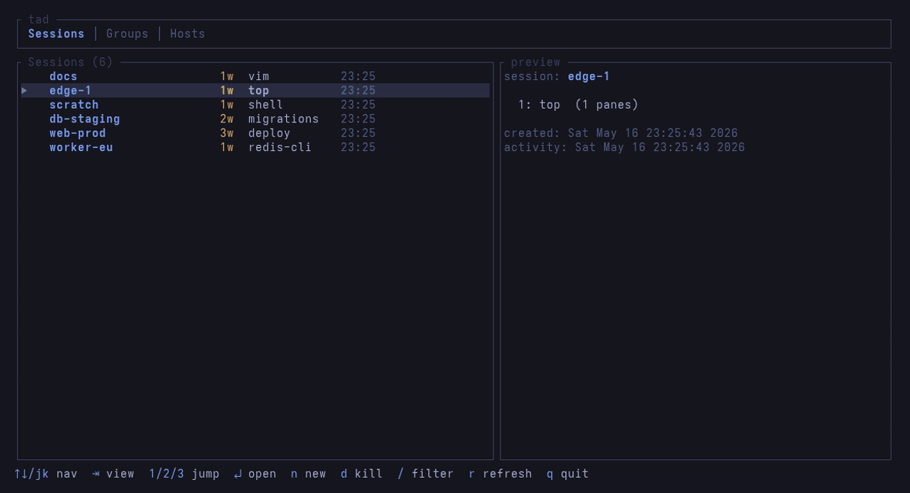 | 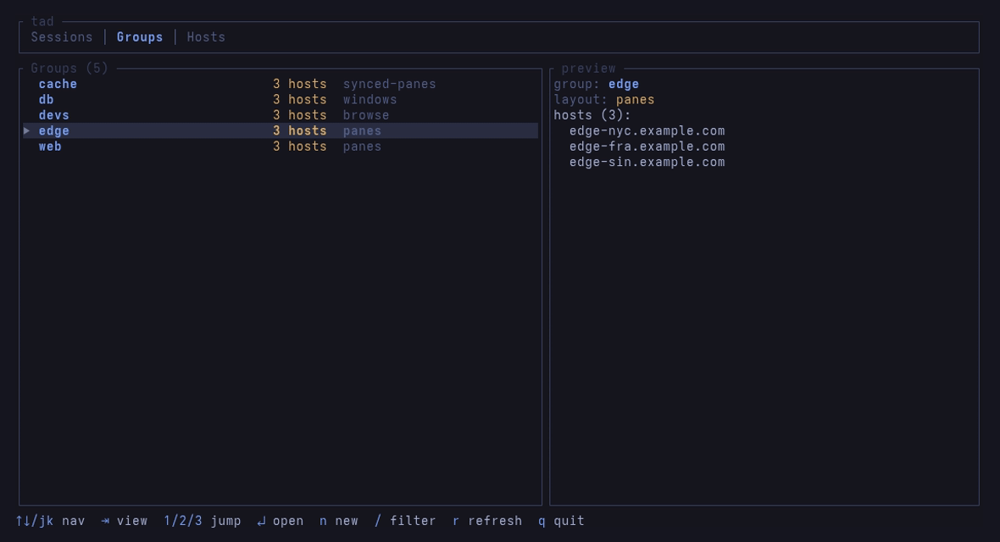 | 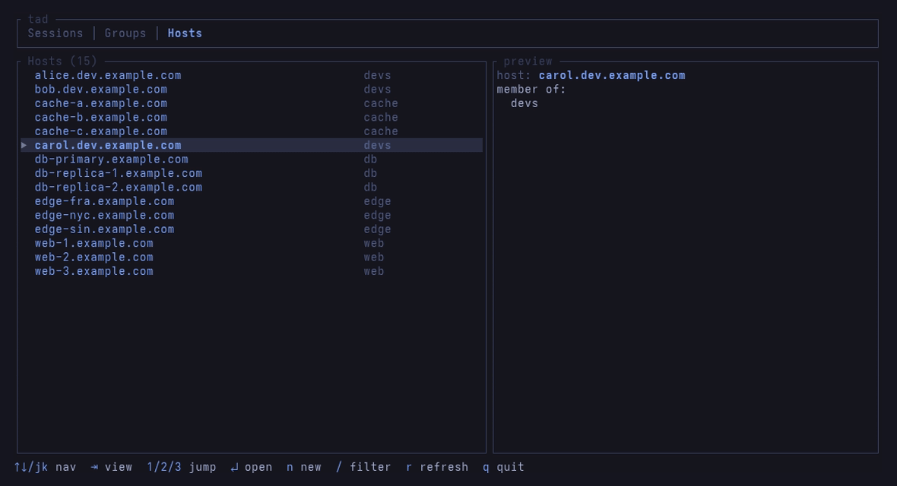 |

Keys:
- `↑/↓` or `j/k`         move selection
- `Tab` / `Shift-Tab`    cycle views forward/back
- `1`, `2`, `3`          jump to Sessions / Groups / Hosts
- `g` / `G`              first / last item
- `Enter`                open the highlighted item
- `n`                    new session — opens a name prompt (preseeded
                         with the highlighted item's short name; edit
                         and Enter to create)
- `d`                    kill (sessions view only)
- `/`                    enter filter mode (type to filter, Esc/Enter exits)
- `r`                    manual refresh
- `q` or `Esc`           quit

Sessions/groups/hosts auto-refresh every ~1.5 seconds.

## Theme

Set in `~/.config/tad/config.yaml`. Default is `tokyonight`. See
`examples/config.yaml.example`.

Built-in names: `tokyonight`, `tokyonight-storm`, `dracula`, `nord`,
`gruvbox`, `catppuccin`, `solarized-dark`, `onedark`, `terminal`.

| tokyonight | tokyonight-storm | dracula | nord |
| --- | --- | --- | --- |
| 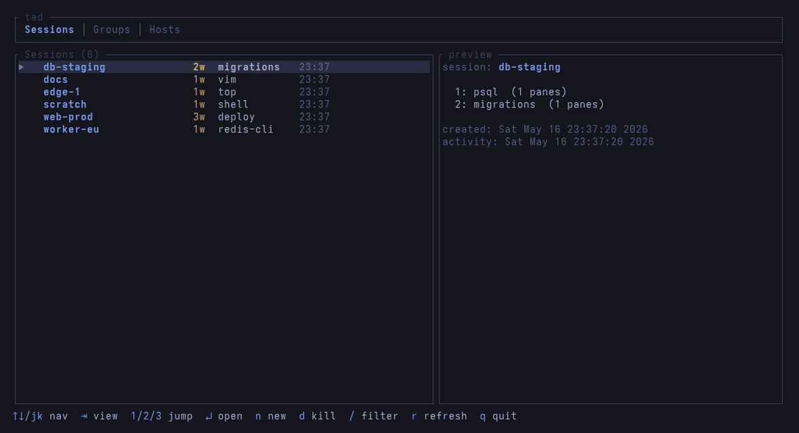 | 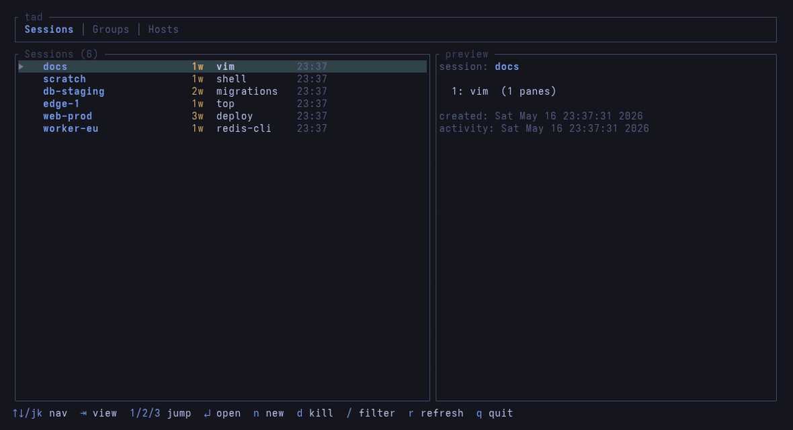 | 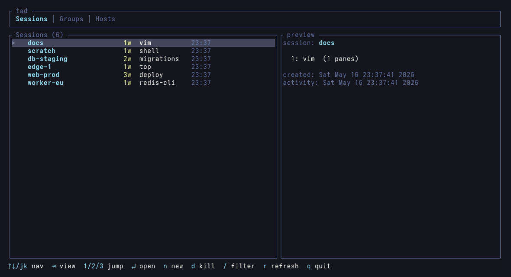 | 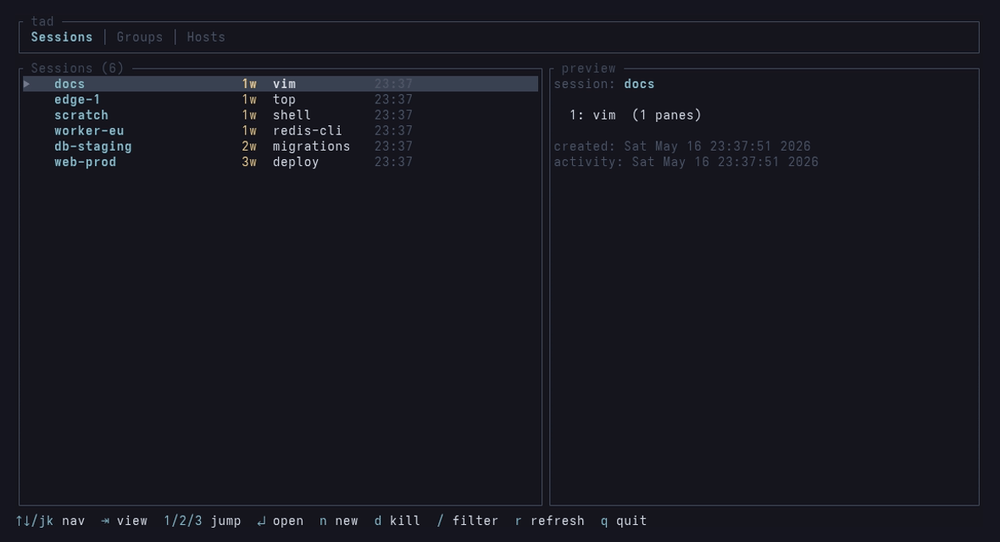 |

| gruvbox | catppuccin | solarized-dark | onedark |
| --- | --- | --- | --- |
| 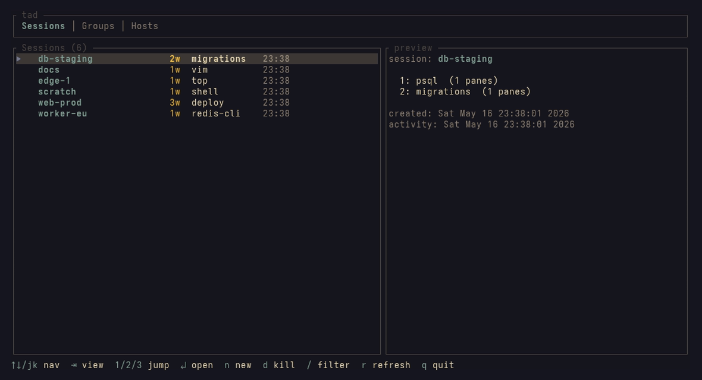 | 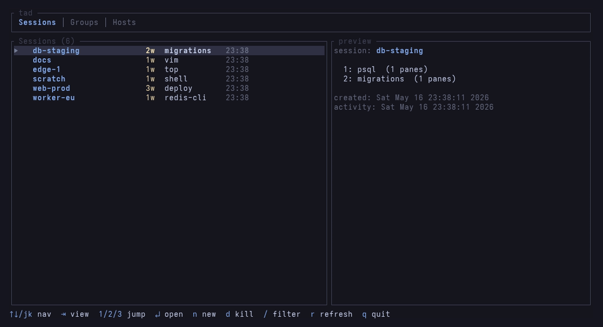 | 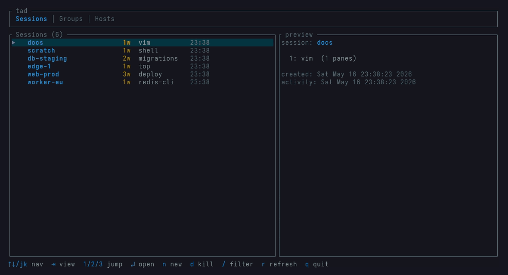 | 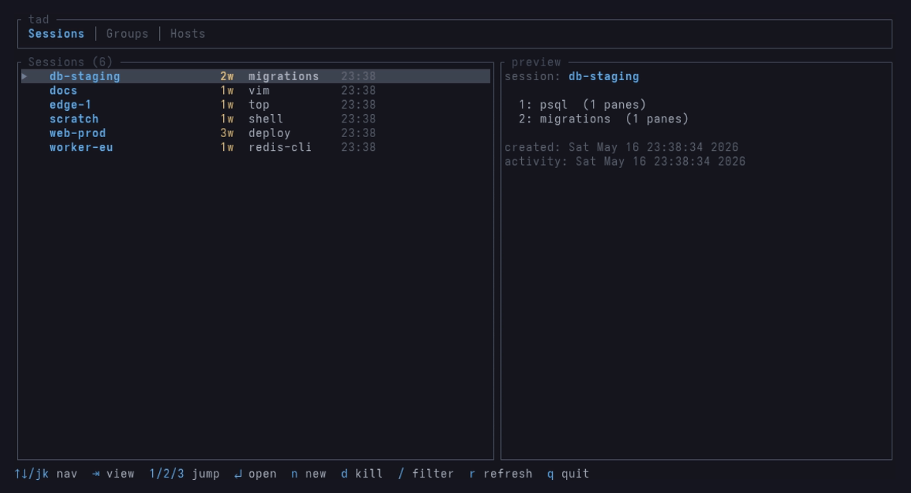 |

```yaml
theme: catppuccin
```

Or override individual colors inline (hex `#rrggbb`):

```yaml
theme:
  accent: "#ff79c6"
  selection_bg: "#222536"
```

## Files

```
~/.config/tad/groups.yaml      — your group definitions
/tmp/tad-dashboard-$USER.state — current dashboard view (transient)
```

## Regenerating the README screenshots

The dashboard demo gif and stills are produced from `vhs` tapes using
sample data under `docs/demo/`. A throwaway tmux server on socket
`tad-demo` is seeded with sample sessions, and a tmux shim
(`docs/demo/bin/tmux`) pins every call to that socket so your real tmux
is never touched.

```sh
cargo build --release             # tapes use target/release/tad if present
vhs docs/demo/dashboard.tape      # writes docs/screenshots/dashboard.gif
bash docs/demo/render-themes.sh   # writes docs/screenshots/theme-*.png
```

To refresh the per-view PNGs (`dashboard-sessions.png`, etc.) extract
frames from the new gif:

```sh
ffmpeg -y -i docs/screenshots/dashboard.gif -vf fps=2 /tmp/tad-f%03d.png
# then cp the frames you like into docs/screenshots/
```
